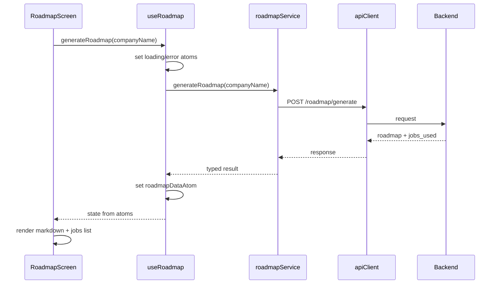

# Frontend Roadmap Integration Plan

## Current Frontend Patterns

- **API**: [src/services/api.ts](Final_Year_Project/Frontend/src/services/api.ts) – axios client at `http://127.0.0.1:8000`.
- **Feature service**: [src/services/jobService.ts](Final_Year_Project/Frontend/src/services/jobService.ts) – uses `apiClient`, returns typed data; errors thrown for route/hook to handle.
- **Types**: [src/types/api.ts](Final_Year_Project/Frontend/src/types/api.ts) – API request/response and UI types.
- **Store**: [src/store/store.ts](Final_Year_Project/Frontend/src/store/store.ts) – Jotai atoms for data, loading, error; derived atoms for filtered data.
- **Hooks**: [src/hooks/useJobs.ts](Final_Year_Project/Frontend/src/hooks/useJobs.ts) – fetches via service, maps via utils, syncs to store; returns `{ loading, error, refetch }`.
- **Screens**: [src/screens/Home.tsx](Final_Year_Project/Frontend/src/screens/Home.tsx) – layout with Header, Sidebar, content; reads from store.
- **Routes**: [src/Routes/AppRoute.tsx](Final_Year_Project/Frontend/src/Routes/AppRoute.tsx) – single `/` route; [Header](Final_Year_Project/Frontend/src/components/Header.tsx) has placeholder "Roadmap" link with `href="#"`.

Backend roadmap endpoint: `POST /roadmap/generate` with body `{ company_name: string }`, returns `{ roadmap: string, jobs_used: Array<{ company, job_title, location, skills_required, job_url }> }` (400/404/503 on error).

---

## Architecture

---

## Implementation Steps

### 1. Types

- **File**: [src/types/api.ts](Final_Year_Project/Frontend/src/types/api.ts).
- Add types for the roadmap API:
  - `RoadmapJobUsed`: `{ company: string; job_title: string; location: string; skills_required: string[]; job_url: string }`.
  - `RoadmapResponse`: `{ roadmap: string; jobs_used: RoadmapJobUsed[] }`.
- No new UI-specific type required unless you later add a “saved roadmap” shape; the screen can use `RoadmapResponse` and `RoadmapJobUsed` directly.

### 2. Service

- **File**: **Add** [src/services/roadmapService.ts](Final_Year_Project/Frontend/src/services/roadmapService.ts).
- Use the same `apiClient` from [src/services/api.ts](Final_Year_Project/Frontend/src/services/api.ts).
- Export `roadmapService.generateRoadmap(companyName: string): Promise<RoadmapResponse>`:
  - `POST /roadmap/generate` with body `{ company_name: companyName }`.
  - Return `response.data` (typed as `RoadmapResponse`).
  - Let errors propagate (axios error with `response.data.detail` for backend message); no console in service to keep parity with jobService.

### 3. Store

- **File**: [src/store/store.ts](Final_Year_Project/Frontend/src/store/store.ts).
- Add roadmap atoms (same pattern as jobs):
  - `roadmapDataAtom` – `atom<RoadmapResponse | null>(null)`.
  - `roadmapLoadingAtom` – `atom<boolean>(false)`.
  - `roadmapErrorAtom` – `atom<string | null>(null)`.
- Import `RoadmapResponse` from `../types/api`.

### 4. Hook

- **File**: **Add** [src/hooks/useRoadmap.ts](Final_Year_Project/Frontend/src/hooks/useRoadmap.ts).
- Use Jotai `useAtom` / `useSetAtom` for `roadmapDataAtom`, `roadmapLoadingAtom`, `roadmapErrorAtom`.
- Expose:
  - `generateRoadmap(companyName: string): Promise<void>` – trim input; set loading true, error null; call `roadmapService.generateRoadmap(companyName)`; on success set data atom and clear error; on catch set error atom (message from `error.response?.data?.detail` or generic); set loading false in finally.
  - Return `{ roadmap: RoadmapResponse | null, loading: boolean, error: string | null, generateRoadmap }` (read from atoms so UI updates when state changes).

### 5. Components (modular, reusable)

- **File**: **Add** [src/components/RoadmapMarkdown.tsx](Final_Year_Project/Frontend/src/components/RoadmapMarkdown.tsx).
  - Props: `content: string` (markdown string).
  - Render with `react-markdown`; optional Tailwind typography (e.g. `@tailwindcss/typography`) or custom prose classes for headings, lists, code. Keep component presentational only.
- **File**: **Add** [src/components/RoadmapJobsUsed.tsx](Final_Year_Project/Frontend/src/components/RoadmapJobsUsed.tsx).
  - Props: `jobs: RoadmapJobUsed[]`.
  - Render a compact list (e.g. company, job_title, location; optional link via job_url). Reuse existing styling patterns (cards/list items) to match [JobCard](Final_Year_Project/Frontend/src/components/JobCard.tsx) / layout.

### 6. Screen

- **File**: **Add** [src/screens/Roadmap.tsx](Final_Year_Project/Frontend/src/screens/Roadmap.tsx).
  - Layout: same shell as Home (Header, main, footer) for consistency; no Sidebar or a minimal one if you prefer.
  - Content:
    - Heading (e.g. “Career Roadmap”).
    - Input for company name (controlled, min length 3 for submit).
    - “Generate Roadmap” button; on submit call `generateRoadmap(companyName)` from `useRoadmap()`.
    - Loading state: disable button and show spinner/message.
    - Error state: show `error` from hook (backend validation/404/503).
    - Success state: render `RoadmapMarkdown` with `roadmap.roadmap` and `RoadmapJobsUsed` with `roadmap.jobs_used`.
  - Use only `useRoadmap`, `RoadmapMarkdown`, and `RoadmapJobsUsed`; no direct service or store access beyond the hook.

### 7. Routing and navigation

- **File**: [src/Routes/AppRoute.tsx](Final_Year_Project/Frontend/src/Routes/AppRoute.tsx).
  - Add route: `<Route path="/roadmap" element={<Roadmap />} />` (lazy or direct import of `Roadmap` from `../screens/Roadmap`).
- **File**: [src/components/Header.tsx](Final_Year_Project/Frontend/src/components/Header.tsx).
  - Replace the Roadmap `<a href="#">` with `<Link to="/roadmap">` from `react-router-dom` so the Roadmap nav item goes to the new screen. Keep “Explore” linking to `/` (or current home route).

### 8. Dependencies

- **File**: [package.json](Final_Year_Project/Frontend/package.json) (or run `npm install react-markdown`).
  - Add dependency: `react-markdown` (for safe markdown rendering in `RoadmapMarkdown`). Optionally add `@tailwindcss/typography` if you want prose styling; otherwise style with Tailwind classes in the component.

---

## Files Summary

| Action | File                                                                                   |
| ------ | -------------------------------------------------------------------------------------- |
| Edit   | `src/types/api.ts` – add `RoadmapJobUsed`, `RoadmapResponse`                           |
| Add    | `src/services/roadmapService.ts` – `generateRoadmap(companyName)`                      |
| Edit   | `src/store/store.ts` – add `roadmapDataAtom`, `roadmapLoadingAtom`, `roadmapErrorAtom` |
| Add    | `src/hooks/useRoadmap.ts` – `generateRoadmap`, state from atoms                        |
| Add    | `src/components/RoadmapMarkdown.tsx` – markdown display                                |
| Add    | `src/components/RoadmapJobsUsed.tsx` – list of jobs used                               |
| Add    | `src/screens/Roadmap.tsx` – form + results using hook and components                   |
| Edit   | `src/Routes/AppRoute.tsx` – add `/roadmap` route                                       |
| Edit   | `src/components/Header.tsx` – Link to `/roadmap`                                       |
| Edit   | `package.json` – add `react-markdown`                                                  |

---

## Modularity Checklist

- **types**: All API shapes in `types/api.ts`; store uses them.
- **services**: Single responsibility; `roadmapService` uses shared `apiClient`; no UI.
- **store**: Roadmap state in same file as jobs; same atom pattern.
- **hooks**: `useRoadmap` encapsulates fetch + store update; screen only uses hook.
- **components**: `RoadmapMarkdown` and `RoadmapJobsUsed` are presentational and reusable.
- **screens**: `Roadmap` composes Header + hook + components; no direct API/store.
- **Routes**: One new route; Header uses router `Link` for navigation.

No changes to existing `utils/` or `store/types.ts` unless you later add shared types there; keeping roadmap types in `types/api.ts` preserves current structure.