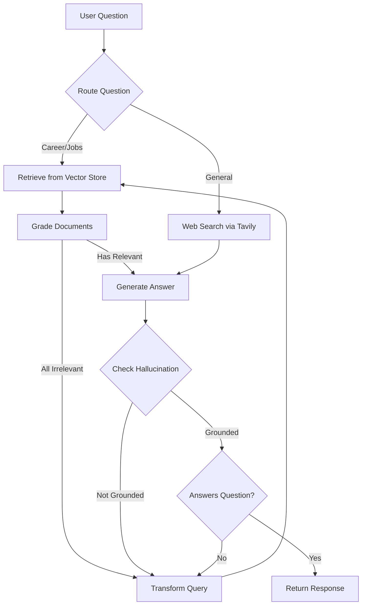
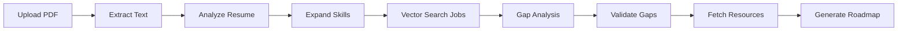

<p align="center">
  
  
  
  
  
</p>

# AI-Powered Career Guidance Platform

> A multi-agent AI system that scrapes live job postings, builds a vector knowledge base, and delivers personalized career roadmaps, skill gap analysis, and an intelligent RAG chatbot — all through a polished React frontend.

---

## Table of Contents

- [Overview](#overview)
- [Key Features](#key-features)
- [System Architecture](#system-architecture)
- [Tech Stack](#tech-stack)
- [Agent Pipeline Details](#agent-pipeline-details)
- [Project Structure](#project-structure)
- [Getting Started](#getting-started)
- [Environment Variables](#environment-variables)
- [Docker Deployment](#docker-deployment)
- [Screenshots](#screenshots)
- [Future Scope](#future-scope)

---

## Overview

LearnLaunch is a full-stack AI career guidance platform built as a Final Year Project. It addresses the gap between job seekers and rapidly evolving industry requirements by:

1. **Autonomously scraping** job listings from Naukri and Foundit using LangGraph-orchestrated Selenium agents.
2. **Building a semantic knowledge base** by generating vector embeddings (Ollama / Qwen3) and storing them in MongoDB Atlas with Vector Search indexes.
3. **Serving intelligent career tools** — a Corrective RAG chatbot, a company-specific roadmap generator, and a resume-based skill gap analyzer — through a FastAPI backend and a premium React (TypeScript) frontend.

---

## Key Features

### 🤖 Corrective RAG Chatbot
- **Adaptive query routing** — LLM-powered router sends career questions to the vector store and general questions to Tavily web search.
- **Document grading** — Each retrieved document is evaluated for relevance; irrelevant results trigger automatic query rewriting.
- **Hallucination detection** — Generated answers are verified against source documents; ungrounded responses are discarded and regenerated.
- **Loop protection** — Retry counter prevents infinite rewrite cycles, gracefully degrading when context is insufficient.
- **Session management** — Full chat history persistence in MongoDB with create/rename/delete operations and multi-session sidebar.

### 🗺️ Career Roadmap Generator
- Enter a target company name (e.g., "Google", "Morgan Stanley") to generate a skill-by-skill learning roadmap.
- Retrieves real job postings via MongoDB Atlas Vector Search, extracts required skills, and builds a week-by-week study plan with free resources, practice exercises, and success criteria.
- Save generated roadmaps to your user profile for progress tracking.

### 🔬 AI Skill Gap Analyzer (8-Node LangGraph Pipeline)
An advanced, multi-stage pipeline that goes far beyond simple keyword matching:

| Node | Purpose |
|------|---------|
| **1. PDF Parser** | Extracts text from uploaded resumes (PDF/DOCX) |
| **2. Resume Analyzer** | LLM extracts skills with context, seniority level, and target roles |
| **3. Skill Expander** | LLM infers implied skills (e.g., Spring Boot → Java, GitHub → Git) — no hardcoded rules |
| **4. Vector Search** | Matches resume profile against 500+ scraped job postings via semantic similarity |
| **5. Gap Analysis** | Identifies missing skills with frequency-based importance classification |
| **6. Gap Validator** | "Skeptical AI" second pass that challenges every proposed gap to eliminate false positives |
| **7. Resource Fetcher** | Live web search (Tavily/DuckDuckGo) for real, verified learning resources — no hallucinated URLs |
| **8. Roadmap Generator** | Produces per-skill learning steps with weekly tasks, capstone projects tied to the user's actual resume projects, and resume bullet suggestions |

### 🕷️ Autonomous Job Scraping Agents
- **Naukri Agent** — Selenium-based scraper with LangGraph state machine: `Fetch → Extract (LLM) → Embed → Store`
- **Foundit Agent** — Same architecture adapted for Foundit.in's DOM structure
- Both agents handle pagination, anti-bot evasion, and structured data extraction via Groq LLM (Llama 3.3 70B)

### 🎨 Premium Frontend
- Built with React + TypeScript + Vite + Tailwind CSS
- Full dark/light theme system using CSS custom properties and semantic design tokens
- Clerk authentication (sign-up, sign-in, user profiles)
- Jotai for lightweight, atomic state management
- Aceternity UI components (parallax hero, wobble cards, floating navbar, typewriter effects)

---

## System Architecture

```
┌─────────────────────────────────────────────────────────────────┐
│                        FRONTEND (React + TS)                    │
│  ┌──────────┐  ┌──────────┐  ┌────────────┐  ┌──────────────┐  │
│  │ RAG Chat │  │ Roadmap  │  │ Skill Gap  │  │   Profile    │  │
│  │  Screen  │  │Generator │  │  Analyzer  │  │  Dashboard   │  │
│  └────┬─────┘  └────┬─────┘  └─────┬──────┘  └──────┬───────┘  │
└───────┼──────────────┼──────────────┼────────────────┼──────────┘
        │              │              │                │
        ▼              ▼              ▼                ▼
┌─────────────────────────────────────────────────────────────────┐
│                     BACKEND (FastAPI)                            │
│  ┌──────────┐  ┌──────────┐  ┌────────────┐  ┌──────────────┐  │
│  │ /chat    │  │/roadmap  │  │/skill-gap  │  │  /users      │  │
│  │ routes   │  │ routes   │  │  routes    │  │  /roadmaps   │  │
│  └────┬─────┘  └────┬─────┘  └─────┬──────┘  └──────────────┘  │
│       │              │              │                            │
│       ▼              │              ▼                            │
│  ┌─────────────┐     │     ┌──────────────────┐                 │
│  │ RAG Agent   │     │     │ 8-Node LangGraph │                 │
│  │ (LangGraph) │     │     │   Skill Pipeline │                 │
│  │             │     │     │                  │                 │
│  │ Route →     │     │     │ Parse → Analyze  │                 │
│  │ Retrieve →  │     │     │ → Expand → Match │                 │
│  │ Grade →     │     │     │ → Gap → Validate │                 │
│  │ Generate →  │     │     │ → Resources →    │                 │
│  │ Verify      │     │     │   Roadmap        │                 │
│  └──────┬──────┘     │     └────────┬─────────┘                 │
│         │            │              │                            │
│         ▼            ▼              ▼                            │
│  ┌─────────────────────────────────────────────────────┐        │
│  │          MongoDB Atlas (Vector Search)               │        │
│  │  ┌──────────┐  ┌───────────┐  ┌──────────────────┐  │        │
│  │  │  jobs    │  │chat_      │  │ user_roadmaps   │  │        │
│  │  │(vectors)│  │sessions   │  │                  │  │        │
│  │  └──────────┘  └───────────┘  └──────────────────┘  │        │
│  └─────────────────────────────────────────────────────┘        │
└─────────────────────────────────────────────────────────────────┘
        ▲                          ▲
        │                          │
┌───────┴──────┐          ┌────────┴───────┐
│ Ollama       │          │  Groq Cloud    │
│ (Embeddings) │          │  (Llama 3.3)   │
│ qwen3-0.6b   │          │  + Tavily      │
└──────────────┘          └────────────────┘
```

---

## Tech Stack

| Layer | Technology |
|-------|-----------|
| **Frontend** | React 18, TypeScript, Vite, Tailwind CSS, Jotai, Clerk Auth |
| **Backend** | Python 3.12, FastAPI, Uvicorn |
| **AI / LLM** | LangGraph, LangChain, Groq (Llama 3.3 70B Versatile) |
| **Embeddings** | Ollama (Qwen3 Embedding 0.6B), MongoDB Atlas Vector Search |
| **Database** | MongoDB Atlas (document store + vector indexes) |
| **Web Search** | Tavily API (primary), DuckDuckGo (fallback) |
| **Scraping** | Selenium WebDriver, BeautifulSoup, WebDriver Manager |
| **DevOps** | Docker, Docker Compose |
| **Auth** | Clerk (React SDK) |

---

## Agent Pipeline Details

### Corrective RAG Flow (Chatbot)



### Skill Gap Analyzer Flow



---

## Project Structure

```
Final_Year_Project/
├── Backend/
│   ├── app/
│   │   ├── api/routes/          # FastAPI route handlers
│   │   │   ├── chat.py          # RAG chatbot endpoints
│   │   │   ├── roadmap_routes.py # Roadmap generation endpoints
│   │   │   ├── skill_routes.py  # Skill gap analysis endpoints
│   │   │   └── roadmaps.py      # Saved roadmap CRUD
│   │   ├── db/mongodb.py        # Async MongoDB connection manager
│   │   ├── models/              # Pydantic data models
│   │   ├── rag/agent.py         # Corrective RAG LangGraph agent
│   │   ├── services/
│   │   │   ├── skill_service.py # 8-node skill gap pipeline
│   │   │   ├── roadmap_service.py # Company roadmap generation
│   │   │   └── user_service.py  # User profile management
│   │   └── main.py              # FastAPI app entry point
│   ├── naukri_agent.py          # Naukri.com scraping agent
│   ├── foundit.py               # Foundit.in scraping agent
│   ├── Dockerfile
│   └── requirements.txt
├── Frontend/
│   ├── src/
│   │   ├── screens/             # Page-level components
│   │   │   ├── LandingPage.tsx  # Marketing landing page
│   │   │   ├── Home.tsx         # Job listings dashboard
│   │   │   ├── JobChat.tsx      # RAG chatbot interface
│   │   │   ├── Roadmap.tsx      # Roadmap generator
│   │   │   ├── SkillAnalyzer.tsx # Skill gap analyzer
│   │   │   └── Profile.tsx      # User profile & saved roadmaps
│   │   ├── components/          # Reusable UI components
│   │   ├── hooks/               # Custom React hooks
│   │   ├── services/            # API client modules
│   │   ├── store/               # Jotai atoms (state management)
│   │   └── index.css            # Design token system (light/dark)
│   ├── tailwind.config.js
│   └── vite.config.ts
├── docker-compose.yaml          # Full-stack orchestration
├── start.bat / start.sh         # One-click local startup
└── README.md
```

---

## Getting Started

### Prerequisites

- **Node.js** ≥ 18 & **npm**
- **Python** ≥ 3.10
- **Docker & Docker Compose** (for containerized deployment)
- **Ollama** installed locally (for embeddings) — [Install Ollama](https://ollama.com)
- **MongoDB Atlas** cluster with Vector Search index configured

### 1. Clone the Repository

```bash
git clone https://github.com/APG9559/FinalYearProject.git
cd FinalYearProject
```

### 2. Backend Setup

```bash
cd Backend
python -m venv venv
venv\Scripts\activate          # Windows
# source venv/bin/activate     # macOS/Linux

pip install -r requirements.txt
```

Pull the embedding model:
```bash
ollama pull qwen3-embedding:0.6b
```

Start the backend:
```bash
uvicorn app.main:app --reload --host 0.0.0.0 --port 8000
```

### 3. Frontend Setup

```bash
cd Frontend
npm install
npm run dev
```

The app will be available at `http://localhost:5173`.

---

## Environment Variables

Create a `.env` file in the `Backend/` directory:

```env
# MongoDB
MONGO_URI=mongodb+srv://<user>:<password>@<cluster>.mongodb.net/
DB_NAME=job_records
COLLECTION_NAME=jobs

# LLM
GROQ_API_KEY=gsk_xxxxxxxxxxxxx

# Embeddings
MODEL_NAME=qwen3-embedding:0.6b
OLLAMA_HOST=http://localhost:11434

# Web Search
TAVILY_API_KEY=tvly-xxxxxxxxxxxxx

# Frontend
FRONTEND_URL=http://localhost:5173
```

For the frontend, create a `.env` in `Frontend/`:

```env
VITE_API_URL=http://localhost:8000
VITE_CLERK_PUBLISHABLE_KEY=pk_xxxxxxxxxxxxx
```

---

## Docker Deployment

The project ships with a full `docker-compose.yaml` that orchestrates all services:

```bash
docker-compose up -d
```

This starts:
- **Ollama** container with health checks and auto model pull
- **Backend** (FastAPI) connected to Ollama and MongoDB Atlas
- **Frontend** (Nginx-served React build) on port 5173

---

## Future Scope

- **Interactive Progress Tracker** — Natural language updates (e.g., "I finished the SQL module") that auto-update roadmap progress and re-evaluate job matches.
- **Real-time Job Alerts** — Scheduled scraping with notification when new roles matching the user's profile appear.
- **Multi-resume Comparison** — Upload multiple versions to track skill growth over time.
- **Team/Cohort Mode** — Shared roadmaps for bootcamp cohorts or university batches.

---

## Authors

**Akash Gurav** — [@APG9559](https://github.com/APG9559)

---

<p align="center">
  <em>Built as a Final Year Project — 2025–2026</em>
</p>
